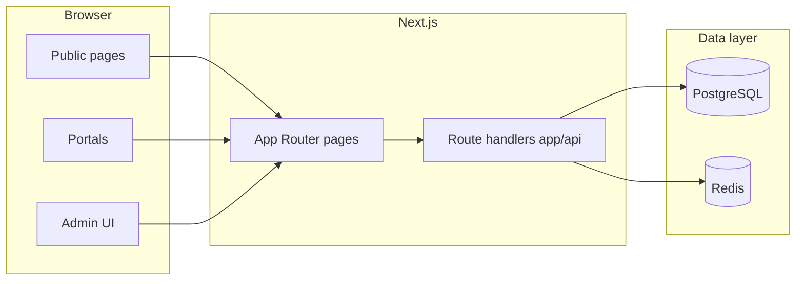

# Africa Trade Awards — project overview

This document is the maintained **feature and architecture inventory** for the repository. For setup and workflows, use [README.md](../README.md) and [CONTRIBUTING.md](../CONTRIBUTING.md). For production deployment, use [COOLIFY_FULLSTACK_SETUP.md](../COOLIFY_FULLSTACK_SETUP.md). For stakeholder gap analysis vs shipped features, see [docs/BOSS_FEEDBACK_VERIFICATION.md](./BOSS_FEEDBACK_VERIFICATION.md).

## What this repository is

The **Africa Trade Awards 2026** digital platform is a **Next.js 14 (App Router)** application with **TypeScript**, **Prisma + PostgreSQL**, **Redis** (caching/queues), **JWT cookie sessions**, and **SCSS** compiled to `public/assets/css/main.css`.

Production runs in **fullstack server mode** (`STATIC_EXPORT=false`): API routes, admin, voting, judging, and event operations require a running Next.js server plus Postgres and Redis. **Static export** (`STATIC_EXPORT=true`) is optional and suitable only for limited brochure-style deployment without dynamic features.

## Roles and access (high level)

Roles are defined in [`prisma/schema.prisma`](../prisma/schema.prisma) (`UserRole`): **SUPER_ADMIN**, **PROGRAM_MANAGER**, **AUDITOR**, **JUDGE**, **ENTRANT**, **VOTER**.

[`middleware.ts`](../middleware.ts) enforces:

- **`/admin/*`** — valid session required; only **AUDITOR** or **PROGRAM_MANAGER**-level (and above) reach the admin UI; others are redirected to their default dashboard.
- **`/portal/entrant`**, **`/portal/nominator`** — login required at least **ENTRANT**.
- **`/portal/judge`** — login required at least **JUDGE**.
- **`/portal/voter`** — login required as **VOTER** (public vote participants).
- **`/login`** — authenticated users are redirected via post-login resolution.
- Legacy **`/admin/login`** redirects to **`/login`** with `next` preserved.

Individual API route handlers perform their own authorization checks.

## Feature map (by surface)

### Public marketing and content

| Area | Routes (examples) | Notes |
|------|-------------------|--------|
| Core site | `/`, `/about`, `/contact`, `/faq` | FAQ and contact can be CMS-backed via API |
| Awards narrative | `/awards-structure`, `/awardees`, `/pricing-plan` | |
| Event marketing | `/event`, `/event-single`, `/event-schedule`, `/event/register`, `/event/ticket` | Registration and ticket flows use events APIs |
| Media / editorial | `/blog`, `/blog-single`, `/gallery`, `/memories`, `/speakers`, `/speakers-single`, `/publications`, `/publications/[slug]` | Includes fixed `africa-trade-awards-2026` and dynamic slugs |
| Partners | `/sponsors-partners` | |
| Live | `/live` | `PublicSiteSettings` in Prisma controls live embed URL and nav “Live” |

### Public program workflows

- **Nominations**: `/nominate`, `/nominate/status` — public submission and tracking; APIs under `app/api/nominations/**` (including `public`, `tracking-link`, admin `convert`, audit).
- **Voting**: `/vote` — APIs under `app/api/voting/**` (entries, cast, request-code/link, verify-code, challenge, quarantine, fraud-report, results).
- **Auth**: `/login` — `app/api/auth/*` (login, logout, me, bootstrap for first admin, impersonation for super-admin).

### Logged-in portals

Program portals (`/portal/*`) share the admin-themed sidebar shell (`app/admin/theme.css`) so navigation and layout align across entrant, voter, nominator, and judge workspaces.

- **Entrant**: `/portal/entrant/` — entry lifecycle (draft through winner/rejected).
- **Voter**: `/portal/voter/` — authenticated voter dashboard linked to public voting (`/vote/`).
- **Nominator**: `/portal/nominator/` — portal-originated nominations (`NominationSource.PORTAL`).
- **Judge**: `/portal/judge/` — assignments, scores, recusals, stages; APIs under `app/api/judging/**`.

### Admin (`/admin/*`)

Includes dashboard, programs/seasons/categories, nominations, entries, voting (including quarantine and fraud UIs), leaderboard, users, exports (votes, users, scores, entries, pack), events (check-in, badge, onsite operations), certificates, site-content (CMS), contact inquiries, and advanced settings. These align with `app/api/admin/**`, `app/api/exports/**`, `app/api/events/**`, and related routes.

### Background and integrations

- **Broadcast worker**: `npm run worker:broadcast` runs `scripts/broadcast-worker.js`; enqueue via `app/api/communications/broadcast/route.ts`.
- **Email**: Nodemailer (SMTP variables documented in `.env.coolify.example`).
- **PDF and QR**: `pdfkit` and `qrcode` for badges, certificates, and event flows.

## Data model (Prisma) — conceptual buckets

From [`prisma/schema.prisma`](../prisma/schema.prisma):

- **Program structure**: `Program`, `Season`, `Category`, `Entry`, `JudgingStage`, `JudgeAssignment`, `Score`, `JudgeRecusal`.
- **Nominations**: `Nomination` (status, source, public nominator fields, optional conversion to `Entry`).
- **Public voting**: `PublicVote`, `VoteVerification`, `VoteTokenUsage` (hashed identifiers, quarantine and review).
- **Events**: `Event`, `EventRegistration`, `EventCheckIn`, `EventBadgePrintLog`, `EventTicketRecoveryCode`, `EventCheckInAttempt`, `EventCheckInQueueItem`, `EventOnsiteIncident`.
- **CMS and marketing**: `PublicSiteSettings` (singleton), `CmsFaq`, `CmsPublication`, `CmsSnippet`, `CmsRevision`, `ContactInquiry`.
- **Audit**: `AuditLog`.

## Documentation inventory

### Primary onboarding (start here)

- [README.md](../README.md) — stack, install, Docker dev (default app port **3003**), Playwright E2E, static vs fullstack modes, Coolify pointer.
- [CONTRIBUTING.md](../CONTRIBUTING.md) — Docker vs host dev, `docker-compose.dev.yml`, Prisma `migrate dev` (local only) vs `migrate deploy` (production), seed, quality commands.
- [COOLIFY_FULLSTACK_SETUP.md](../COOLIFY_FULLSTACK_SETUP.md) — fullstack compose (`docker-compose.coolify.yml`), environment variables, bootstrap admin, Postgres health notes.
- Root env templates: `.env.example`, `.env.docker.example`, `.env.coolify.example`.
- [.cursor/rules/project.mdc](../.cursor/rules/project.mdc) — Cursor workspace conventions for contributors.

### Docker and deployment variants

- [DOCKER.md](../DOCKER.md)
- [COOLIFY_DEPLOYMENT.md](../COOLIFY_DEPLOYMENT.md), [COOLIFY_SETUP_GUIDE.md](../COOLIFY_SETUP_GUIDE.md) — confirm which compose file and mode each guide assumes (fullstack vs static).

### Checklists and migration notes

- [DEPLOYMENT_CHECKLIST.md](../DEPLOYMENT_CHECKLIST.md), [DOMAIN_SETUP.md](../DOMAIN_SETUP.md), [MIGRATION_SUMMARY.md](../MIGRATION_SUMMARY.md) — verify against current code before relying on them.

### Troubleshooting and incident notes

- [BAD_GATEWAY_FIX.md](../BAD_GATEWAY_FIX.md), [PORT_CONFIGURATION_FIX.md](../PORT_CONFIGURATION_FIX.md), [DEBUG_CHECK.md](../DEBUG_CHECK.md), [DIRECTORY_CHECK.md](../DIRECTORY_CHECK.md), [COOLIFY_AWARDEE_IMAGES_FIX.md](../COOLIFY_AWARDEE_IMAGES_FIX.md), [ELSEWEDY_IMAGE_DIAGNOSIS.md](./ELSEWEDY_IMAGE_DIAGNOSIS.md), [OPTIMIZATION_REVIEW.md](../OPTIMIZATION_REVIEW.md).

### Historical or snapshot documents

- [PROJECT_REVIEW.md](../PROJECT_REVIEW.md) — **historical**: written for a **static-export-only** posture; it does not describe the current fullstack platform. Prefer **this overview** and [README.md](../README.md) for architecture.
- [PUSH_READY.md](../PUSH_READY.md), [TEST_RESULTS.md](../TEST_RESULTS.md), [VERIFICATION_COMPLETE.md](../VERIFICATION_COMPLETE.md) — session snapshots; confirm with `npm run lint`, `npm run typecheck`, and `npm run test:e2e`.

## Quality and operations commands

- Lint and types: `npm run lint`, `npm run typecheck`
- E2E: `npm run test:e2e` (set `E2E_*` variables as in README)
- HTTP smoke: `npm run smoke:http`
- Onsite verification: `npm run ops:verify`

## Mental model

1. **Public site** — marketing pages, CMS-driven fragments, and contact.
2. **Competition pipeline** — nominations, optional conversion to entries, judging, optional public voting, winners, certificates, exports.
3. **Event day** — registrations, QR check-in, badge PDFs, offline queue sync, incidents, reporting APIs.
